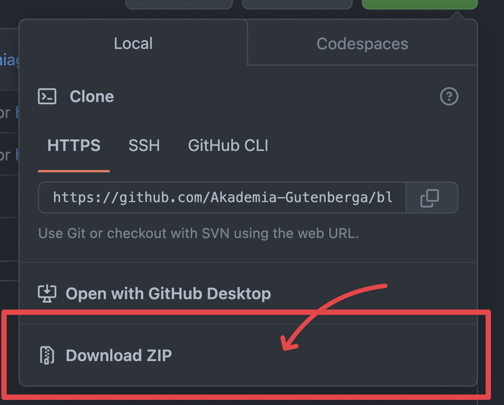
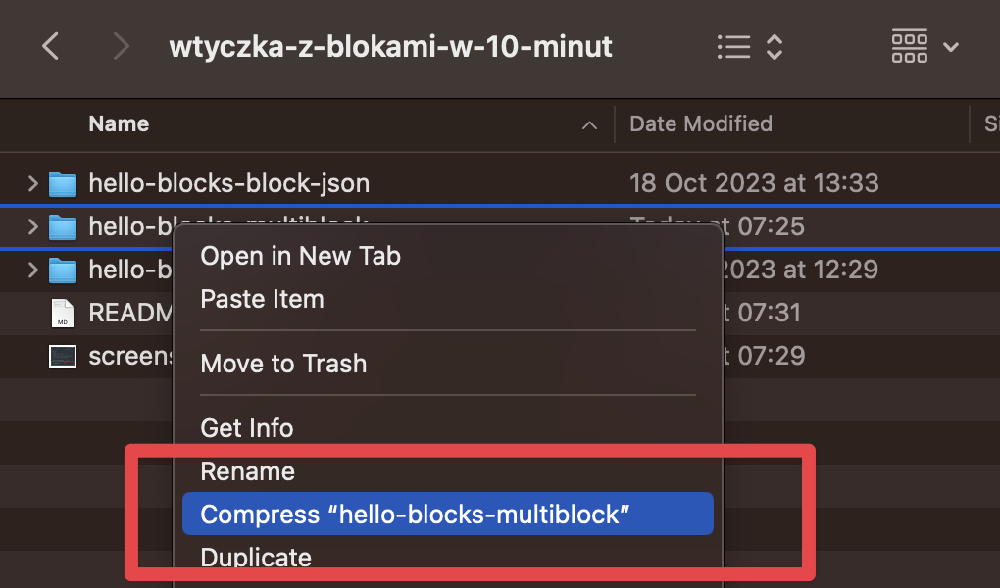

# Jak w mniej niż 10 minut stworzyć własną wtyczkę do Gutenberga dodającą nowe bloki?

Kod źródłowy wpisu: [uzupełnić po publikacji]

## Wymagania

Zainstalowany lokalnie WordPress.

## Użycie

1. Pobierz paczkę zip tego repozytorium

2. Rozpakuj paczkę

3. Przejdź do folderu `wtyczka-z-blokami-w-10-minut`

4. Wybierz jeden z folderów (wszystkie trzy zawierają wtyczkę), a następnie utwórz z nich plik .zip (cały folder, nie pliki wewnątrz)

5. Wgraj plik zip do panelu w sekcji instalacji wtyczek oraz aktywuj wtyczkę

Gotowe. Możesz sprawdzić działanie wtyczki w WordPressie i eksporować kod!
